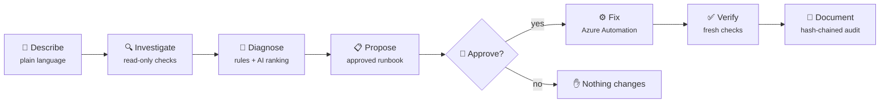
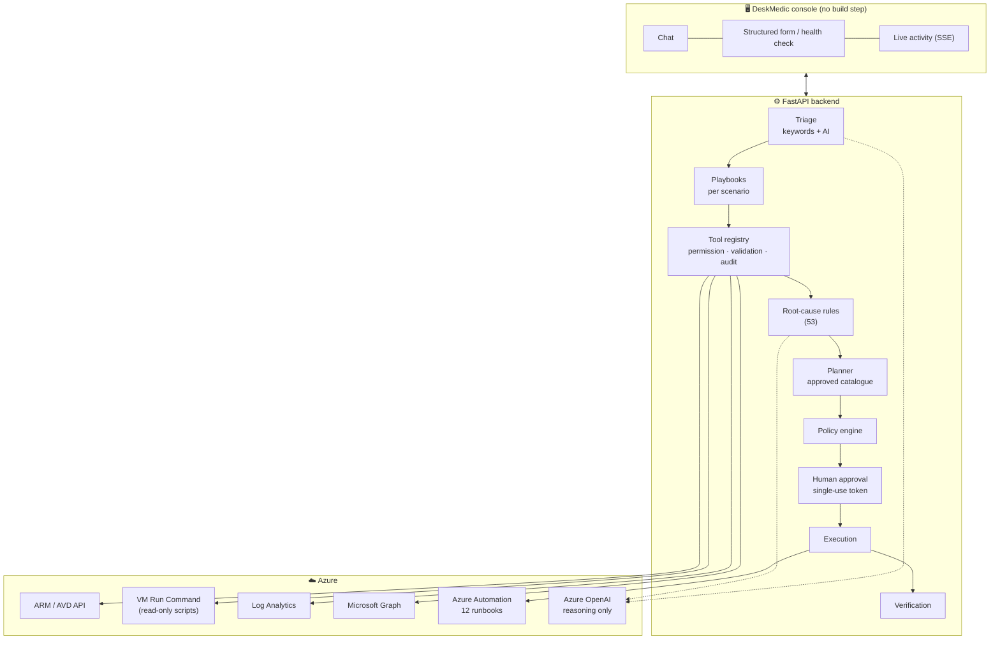

<div align="center">

# 🩺 DeskMedic

### The AI troubleshooting agent for Azure Virtual Desktop

**Describe the problem in plain language. DeskMedic finds the root cause, proposes a safe fix,
runs it after you approve, and proves it worked.**


[What it does](#-what-it-does) •
[Why it matters](#-why-it-matters) •
[Quick start](#-quick-start-2-minutes-no-azure-needed) •
[Run on Azure](#-run-against-a-real-azure-environment) •
[How it works](#-how-it-works) •
[Safety](#-safety-by-design) •
[Extend it](#-extending-deskmedic)

</div>

---

## 📌 At a glance

| | |
|---|---|
| 🔍 **Investigates** | **42 read-only checks**: session hosts, AVD agent, FSLogix, storage, DNS, network, Entra ID, sign-ins, Log Analytics |
| 🧠 **Diagnoses** | **53 root causes** across **25 scenarios**, every one backed by cited evidence |
| 🛠️ **Fixes** | **15 approved fixes** run through **12 reviewed PowerShell runbooks**, only after a human approves |
| ✅ **Verifies** | Re-checks the environment after every fix. It never reports "fixed" without proof |
| 👀 **Shows its work** | Live activity feed and a progress bar: every check, stage and job status as it happens |
| 🛡️ **Never deletes data** | No profile, VHDX, host pool or Azure resource is ever removed. Enforced in code |

---

## 🎯 What it does

An engineer types what the user reported:

> **"jdoe has a temporary profile"**

DeskMedic then works through the incident:



1. **Finds the user's host by itself.** No host names needed. It uses the user's live session; if they signed out, it falls back to the host they last used.
2. **Runs the right checks** for that kind of problem, in parallel, and shows each one live.
3. **Names the root cause** with the evidence behind it: *"FSLogix Apps service is not running (on vm-d2click-02)"*.
4. **Proposes the smallest safe fix**, *"Restart the FSLogix Apps service (LOW risk)"*, and waits for your approval.
5. **Runs it immediately** when you click **Approve**, then **re-checks** that the problem is really gone.

---

## ⏱️ Why it matters

The time an engineer spends on an AVD ticket is mostly **finding** the problem and **waiting on escalation**, not applying the fix.

| | 👨‍💻 Manual (L1 → L2) | 🩺 DeskMedic |
|---|---|---|
| Find the user's host | 5–10 min | automatic |
| Connect to the VM, read logs, check services | 15–30 min | 30–60 s, in parallel |
| Identify the root cause | 10–20 min | seconds, with cited evidence |
| Escalation queue (L1 can't fix it) | 1–3 hours | none: L1 investigates, L2 clicks Approve |
| Apply the fix | 5 min | 40 s – 2 min |
| Confirm it worked | 5–15 min | automatic re-check |
| Ticket notes | 5–10 min | automatic audit trail |
| **Total** | **1–4 hours** | **≈ 2–5 minutes + one approval click** |

> Manual figures are typical service-desk estimates. DeskMedic figures were measured in a real Azure lab:
> full host health check **46 s** (11 checks), host investigation **84–117 s**, 8 in-VM checks **33 s**.

---

## 🧰 What it can troubleshoot

Each row is a scenario: the agent recognises it from plain language, runs its checklist, and either **fixes** it (after approval) or gives the **exact steps** when the fix belongs to another team.

**Legend:** 🟢 auto-fix (LOW risk) · 🟠 auto-fix (MEDIUM risk) · 📘 diagnose and guide (a human applies the change)

### 🖥️ Hosts and registration

| Scenario | What DeskMedic checks | Fix |
|---|---|---|
| Session host unavailable | VM power, platform health, broker registration, heartbeat, agent services, DNS, TCP/443, NSG, routes, activity log | 🟢 restart AVD agent · 🟠 restart VM |
| AVD agent unhealthy | RDAgent / BootLoader services, broker status, event log | 🟢 restart AVD agent |
| Host not registering | `IsRegistered`, `INVALID_REGISTRATION_TOKEN`, pool membership | 🟠 new token + re-register |
| Pending reboot | servicing / Windows Update reboot markers | 🟠 safe restart (refuses while users are connected) |
| Drain mode left on | host Available but not accepting sessions | 🟠 return host to pool |
| Scaling plan | plan attached and enabled, Power On/Off role | 📘 |

### 👤 Profiles and sessions

| Scenario | What DeskMedic checks | Fix |
|---|---|---|
| FSLogix temporary profile | frxsvc service, profile state, stale container lock, SMB reachability | 🟢 restart FSLogix · 🟠 release stale lock (never deletes data) |
| Profile disk full | free space inside the profile VHDX vs `SizeInMBs` | 📘 (never deletes data) |
| Slow logon | FSLogix profile load time, Group Policy time, profile size | 📘 |
| Black screen after login | shell (explorer.exe) not started, AppReadiness timeout, slow GPO | 🟠 sign out hung session · 🟢 restart AppReadiness |
| Stuck / orphaned session | disconnected sessions, session limit | 🟠 sign out session (immediately) |
| "Clear the session" | any session the engineer reports as stuck | 🟠 sign out now, via the AVD service like the portal |
| Session disconnects | heartbeat drops, round-trip time, idle-timeout policy | 📘 |

### 🌐 Identity and network

| Scenario | What DeskMedic checks | Fix |
|---|---|---|
| User cannot connect | assignment, pool capacity, host health, connection errors | depends on the cause |
| SSO / authentication | Entra account exists and is enabled, sign-in failures, MFA, **Conditional Access (names the failing policy)**, SSO RDP property | 📘 |
| Domain trust broken | secure channel, DC reachability on 88/389 | 📘 |
| Clock skew | offset vs time source (Kerberos breaks beyond 5 min) | 🟢 resync clock |
| Azure Files / storage | DNS, TCP/445, firewall, private endpoint, permissions | 📘 |
| DNS resolution | name resolution from the host | 🟢 flush DNS / restart DNS client |
| Required URLs / private DNS | AVD endpoints on 443, proxy, storage resolving to its public IP | 📘 |

### 📦 Apps, devices and clients

| Scenario | What DeskMedic checks | Fix |
|---|---|---|
| RemoteApp not launching | published apps and whether each file exists on the host | 📘 |
| MSIX App Attach | registered packages and whether they are active | 📘 |
| Teams optimization | Teams install, `IsWVDEnvironment`, WebRTC redirector service | 📘 |
| Device redirection | host pool RDP properties and host Group Policy | 📘 |
| Performance | CPU, memory, top processes and their users | 🟠 drain host (never kills user processes) |
| Client-side (Windows App) | client version, client-side disconnects, users who never reach AVD | 📘 |
| Thin client (ThinOS, IGEL…) | thin-client OS with connection failures | 📘 |

### 🩻 Full health check

Leave the description empty and pick **just a host or a user**. DeskMedic sweeps everything (VM, agent, FSLogix, reboot, clock, domain trust, CPU/memory, required URLs) and reports whatever is wrong.

### 🔢 Error-code library

`explain_avd_error_code` turns **20 documented codes** (connection, agent, health check and FSLogix) into a meaning and a next step. Unknown codes are reported as unknown, never guessed.

---

## 🚀 Quick start (2 minutes, no Azure needed)

DeskMedic ships with a **simulated AVD estate**: 4 host pools, 15 session hosts and real faults to fix. The demo actually changes and re-checks that estate.

```bash
git clone <this-repo> avd-ai-agent
cd avd-ai-agent

make setup                                    # virtualenv + dependencies
AVD_AGENT_MODE=mock AZURE_OPENAI_ENDPOINT= make run
```

Open **http://127.0.0.1:8080**, then:

1. Open **"Prefer a form?"** and pick a session host (for example `AVD-VM-023`), leaving the description empty.
2. Click **Investigate** and watch the live activity panel.
3. Switch the top-right toggle to **Troubleshoot**, then click **Approve & Execute**.
4. Watch it run, verify, and finish **Resolved**.

<details>
<summary><b>🎭 Demo faults you can try</b></summary>

| Try this | Host / user | Root cause |
|---|---|---|
| Session host unavailable | `AVD-VM-023` | AVD agent stopped |
| Temporary profile | `priya.patel@contoso.com` | Stale FSLogix lock |
| Black screen | `testuser01@contoso.com` | Shell never started |
| Stuck session | `testuser02@contoso.com` | Orphaned disconnected session |
| Pending reboot | `AVD-VM-033` | Windows Update reboot pending |
| Clock skew | `AVD-VM-034` | 412 s drift, Kerberos broken |
| Host not registering | `AVD-VM-035` | Invalid registration token |
| High CPU | `AVD-VM-043` | Host exhausted, drained |
| Conditional Access | `testuser08@contoso.com` | Device-compliance policy |

Reset everything: `curl -X POST http://127.0.0.1:8080/api/mock/reset`

</details>

> The demo uses a deterministic mock AI, so the chat is limited. The structured form and every fix work in full.

---

## ☁️ Run against a real Azure environment

### Prerequisites

| Requirement | Why |
|---|---|
| An AVD host pool with session hosts | the estate to troubleshoot |
| **Azure OpenAI** with a `gpt-4o` deployment | plain-language understanding and explanations |
| **Azure Automation** account with the 12 runbooks published | the only path that can make changes |
| **Log Analytics** + AVD diagnostic settings | connection errors, network quality, client data |
| Az modules in Automation: `Az.Accounts`, `Az.Compute`, `Az.Storage`, `Az.DesktopVirtualization` | used by the runbooks |
| *(Optional)* Microsoft Graph: `User.Read.All`, `GroupMember.Read.All`, `AuditLog.Read.All` | Entra account, assignment and sign-in checks |

### 1. Deploy the lab (or point at your own estate)

A complete Terraform lab (domain controller, FSLogix storage, host pool, monitoring, Azure OpenAI, Automation and RBAC) lives in a companion repo. Deploy it stage by stage:

```powershell
terraform init
terraform plan '-target=module.resourcegroup' '-out=s1.tfplan'; terraform apply s1.tfplan
terraform plan '-target=module.vnet'          '-out=s2.tfplan'; terraform apply s2.tfplan
terraform plan '-target=module.storage'       '-out=s3.tfplan'; terraform apply s3.tfplan
terraform plan '-target=module.dc'            '-out=s4.tfplan'; terraform apply s4.tfplan   # ~30 min
terraform plan '-target=module.avd'           '-out=s5.tfplan'; terraform apply s5.tfplan   # ~20 min
terraform plan '-target=module.monitoring'    '-out=s6.tfplan'; terraform apply s6.tfplan
terraform plan '-target=module.agent'         '-out=s7.tfplan'; terraform apply s7.tfplan
```

> **PowerShell tip:** quote the whole argument (`'-out=s1.tfplan'`). PowerShell otherwise splits it at the dot.

### 2. Configure the agent

```powershell
terraform apply -refresh-only -auto-approve                      # record outputs
terraform output -raw agent_dotenv > ../avd-ai-agent/.env
```

Or fill in `.env` by hand:

| Variable | Example | Notes |
|---|---|---|
| `AVD_AGENT_MODE` | `azure` | `mock` for the simulated estate |
| `AZURE_OPENAI_ENDPOINT` | `https://oai-….openai.azure.com/` | empty → mock AI |
| `AZURE_OPENAI_DEPLOYMENT` | `gpt-4o` | |
| `AZURE_OPENAI_AUTH_MODE` | `api_key` / `managed_identity` | |
| `AZURE_OPENAI_API_KEY` | | only for `api_key` |
| `AZURE_SUBSCRIPTION_ID` / `AZURE_TENANT_ID` | | |
| `AUTOMATION_ACCOUNT_NAME` / `AUTOMATION_RESOURCE_GROUP` | `aa-avd-agent-…` | where runbooks run |
| `LOG_ANALYTICS_WORKSPACE_ID` | workspace GUID | optional, enables history checks |
| `REMEDIATION_ENABLED` | `false` → `true` | global kill switch; start with `false` |
| `BLOCKED_RISK_LEVELS` | `high` | never executable |
| `APPROVAL_TTL_SECONDS` | `900` | single-use approval token lifetime |

### 3. Run

```bash
az login
.venv/bin/pip install -e ".[azure]"
make run
```

The header badge should read **mode: azure**. Ask *"How many session hosts do I have?"*: it answers from your real subscription.

### 4. Grant Graph permission (optional, for identity checks)

```powershell
az ad app permission add --id <agent-app-id> --api 00000003-0000-0000-c000-000000000000 `
  --api-permissions df021288-bdef-4463-88db-98f22de89214=Role 98830695-27a2-44f7-8c18-0c3ebc9698f6=Role b0afded3-3588-46d8-8b3d-9842eff778da=Role
az ad app permission admin-consent --id <agent-app-id>
```

Without Graph permission, identity checks report **"NOT CHECKED: needs User.Read.All"** instead of guessing. Sign-in logs also need an Entra ID P1/P2 licence.

---

## 🧠 How it works

### Architecture



### The core design decision

> **Azure OpenAI has no Azure credentials, no execution capability, and cannot name a target.**

The AI does four narrow jobs, and every answer is checked against a closed list the backend supplied:

| AI job | Allowed answer | If it answers wrongly |
|---|---|---|
| Understand the engineer's words | one of 25 scenarios | discarded; keyword triage stands |
| Chat: pick a read-only check | a tool from the read-only list | non-read-only tools are refused in code |
| Rank root causes | ids from the rules-derived list | unknown ids dropped; confidence capped |
| Explain the diagnosis | prose | over-long or empty prose discarded |

Even a fully successful prompt injection can at worst mis-rank a cause, which then fails policy validation.

### What makes it fast

| Technique | Effect |
|---|---|
| **Parallel waves**: independent checks run at the same time | ARM, Log Analytics and Graph calls overlap |
| **Run Command merging**: in-VM checks for one VM become **one** Run Command | 8 checks: **293 s → 33 s** |
| **Per-check isolation**: one broken script can't break the batch | the speed-up survives a bad check |
| **Busy-VM retry**: handles Azure's "Run Command in progress" | no spurious failures |
| **AVD-service sign-out**: sessions cleared like the portal does | 2–3 min → ~40–70 s |
| **No wait rules**: approved fixes run immediately | no 15/30-minute thresholds |

### Live progress

Every console request opens a **Server-Sent Events** stream. The orchestrator, tool registry and execution layer publish to it, so you watch the agent work in real time:

```text
Now: checking get_fslogix_status
▸ Understanding the problem
▸ Issue type: fslogix temp profile
▸ Running 5 checks on vm-d2click-02
  get_fslogix_status   FSLogix service frxsvc is Stopped (32.8s)
▸ Root cause: FSLogix Apps service is not running
▸ Fix ready: Restart the FSLogix Apps service - waiting for your approval
▸ Approved by you - running Restart-FslogixService
  Automation job Queued → Running → Completed
▸ Resolved - verified fixed
```

The progress bar (**Describe → Diagnose → Approve → Fix → Verify**) follows the same stream.

---

## 🛡️ Safety by design

| Control | Enforced in |
|---|---|
| AI cannot execute, approve, or choose a target | `agent/llm.py`, `agent/triage.py`, `api/routes.py` |
| Closed action catalogue; there is **no "run any PowerShell"** | `powershell/catalog.py`, `tools/remediation/` |
| Every parameter allowlisted before any Azure call | `security/validators.py` |
| Every write passes the same gate as reads: permission → validation → audit | `tools/base.py` |
| **Approval required for every change**; L1 can't approve | `approval/service.py` |
| Single-use, time-limited approval token | `approval/service.py` |
| Policy re-checked immediately before execution | `agent/policy.py` |
| HIGH-risk actions blocked; profile deletion **prohibited** | `agent/policy.py`, `powershell/catalog.py` |
| Static scanner blocks deletion, encoded commands, firewall/AV tampering in every runbook | `powershell/validator.py` |
| Only **published** runbooks can run | `providers/azure/execution.py` |
| Verification is mandatory; the runbook's own word isn't trusted | `verification/service.py` |
| Untrusted text (logs, descriptions) fenced and scanned for injection | `security/injection.py` |
| **Two identities**: the agent reads; only Automation can write | Terraform RBAC |
| Hash-chained, tamper-evident audit log with secrets redacted | `audit/sink.py` |

**What DeskMedic will never do:** delete a profile, VHDX, share, host pool or Azure resource · kill a user's process · sign out a working user without an explicit "clear the session" request and approval · grant permissions · change Conditional Access · disable security tooling.

---

## 📜 Approved runbooks

| Runbook | Risk | What it does | Refuses when |
|---|---|---|---|
| `Restart-AvdAgent` | 🟢 LOW | starts the AVD agent boot loader, waits for **Available** | VM not running |
| `Restart-FslogixService` | 🟢 LOW | restarts frxsvc | users are active (unless approved) |
| `Repair-WindowsService` | 🟢 LOW | starts one allowlisted service | start type is Disabled |
| `Repair-AvdDnsClient` | 🟢 LOW | restarts the DNS client and flushes the cache | — |
| `Repair-TimeSync` | 🟢 LOW | starts W32Time and forces a resync | service Disabled |
| `Restart-AppReadinessService` | 🟢 LOW | starts AppReadiness | service hung in a pending state |
| `Clear-StaleFslogixLock` | 🟠 MEDIUM | closes a stale SMB handle on the profile. **Never deletes data** | user still has a live session |
| `Invoke-AvdUserLogoff` | 🟠 MEDIUM | signs out one user's session via the AVD service | mode/state mismatch |
| `Set-AvdSessionHostDrainMode` | 🟠 MEDIUM | drain or undrain one host | — |
| `Register-AvdSessionHost` | 🟠 MEDIUM | short-lived token + re-register (token never logged) | host has active sessions |
| `Restart-AvdSessionHostVm` | 🟠 MEDIUM | drain → restart → wait for **Available** | users are connected |
| `Test-AzureFilesConnectivity` | read-only | deep Azure Files reachability probe | — |

Every runbook is parameterised, idempotent, logs one JSON line per phase, and passes the static safety scanner on every test run. See [docs/runbook-standard.md](docs/runbook-standard.md).

---

## 🗂️ Project structure

```text
avd-ai-agent/
├── backend/app/
│   ├── agent/              # triage, playbooks, root-cause rules, diagnosis, planner, policy, orchestrator, chat
│   ├── tools/
│   │   ├── diagnostics/    # 42 typed read-only checks
│   │   └── remediation/    # one tool per approved action (no run_powershell exists)
│   ├── providers/
│   │   ├── mock/           # stateful simulated AVD estate + runbook handlers
│   │   └── azure/          # ARM, AVD API, Run Command (merged), Log Analytics, Graph, Automation
│   ├── powershell/         # action catalogue, safety scanner, script generator
│   ├── security/           # identity, parameter validators, prompt-injection defence
│   ├── knowledge/          # retriever + curated AVD error-code library
│   ├── progress.py         # live progress stream (SSE)
│   ├── approval/ · verification/ · audit/ · store/ · api/
├── frontend/               # DeskMedic console: HTML/CSS/JS, no build step
├── runbooks/               # 12 approved PowerShell runbooks
├── knowledge/              # 26 provenance-tagged docs (Microsoft docs + internal SOPs)
├── tests/                  # 266 unit · integration · safety tests
├── infra/terraform/        # Container Apps, Azure OpenAI, Automation, RBAC
└── docs/                   # architecture, security, troubleshooting flows, runbook standard
```

---

## 🧪 Testing

```bash
make test     # 266 tests, ~7 seconds, always against the simulated estate
make lint     # ruff
```

| Suite | Covers |
|---|---|
| `tests/unit` | validators, safety scanner, tool verdicts, triage, Run Command merging and retries, Graph refusals |
| `tests/integration` | every scenario end to end (investigate → approve → execute → verify), the HTTP API, live progress, health checks |
| `tests/safety` | prompt injection, privilege enforcement, token replay, kill switch, audit tampering, secret redaction |

The safety suite is the one that matters: it asserts that the agent **refuses**. Every shipped runbook is re-scanned for dangerous patterns on every run.

---

## 🧩 Extending DeskMedic

<details>
<summary><b>📚 Add knowledge</b>: drop in a Markdown file</summary>

```markdown
---
title: Teams crashes after FSLogix update
source: internal_sop
tags: [teams, crash, fslogix, cache]
reference: https://your-wiki/link
---
# Teams crash on AVD
…your steps…
```

Save it under `knowledge/` and restart the agent. Tags drive retrieval.

</details>

<details>
<summary><b>🛠️ Add a new fix</b>: script, catalogue, rule, publish</summary>

1. Write the runbook in `runbooks/<area>/`, following [docs/runbook-standard.md](docs/runbook-standard.md).
2. Register it in `backend/app/powershell/catalog.py` with risk, parameters and pre/post checks.
3. Add a root-cause rule in `backend/app/agent/root_causes.py`.
4. Add checks to the scenario's playbook in `backend/app/agent/playbooks.py`, if needed.
5. Add it to the Terraform `runbooks` list and publish it to Automation.
6. Run `make test`: the scanner and catalogue tests cover it automatically.

</details>

<details>
<summary><b>🔍 Add a new check</b></summary>

Add a typed tool in `backend/app/tools/diagnostics/tools.py`, a provider method in both `providers/mock` and `providers/azure`, and register it in `build_diagnostic_tools`. In-VM scripts are merged automatically.

</details>

---

## 🩹 Troubleshooting DeskMedic itself

| Symptom | Fix |
|---|---|
| Badge says **mode: mock** | `.env` not saved, or an old server is still running: `lsof -ti :8080 \| xargs kill`, then `make run` |
| *"Language model is unavailable"* | check `AZURE_OPENAI_ENDPOINT`, key and deployment name |
| *"Remediation is disabled"* | set `REMEDIATION_ENABLED=true` and **restart** (`.env` is read at start-up) |
| *"Read-only mode"* | switch the top-right toggle to **Troubleshoot** |
| *"runbook … not published"* | Automation → Runbooks → open it → **Publish** |
| *"NOT CHECKED: needs User.Read.All"* | grant the Graph permissions above |
| *"The script on the host returned no result. Host error: …"* | the real in-VM error is shown; act on it |
| No user session found | the user signed out; the agent uses their last host, or tell it the host |

---

## 🗺️ Roadmap

- [ ] **Proactive health scan:** find issues across every host before users report them
- [ ] **Hybrid Runbook Worker:** cut the 30–60 s Automation job start to seconds
- [ ] **Optional auto-run for LOW-risk fixes** (off by default)
- [ ] **Stale-lock holder detection on Azure:** identify which host holds a profile lock
- [ ] Durable incident store and Azure AI Search for knowledge retrieval
- [ ] Teams / ServiceNow ticket integration

## ⚠️ Known limitations

- Identity checks need Microsoft Graph permissions; sign-in logs need Entra ID P1/P2.
- Incidents are held in memory; the audit log is on disk (both sit behind interfaces for durable backends).
- HIGH-risk changes (NSG, routes, storage permissions, RBAC) are proposal-only by design.
- The offline demo uses a deterministic mock AI, so free-form chat needs Azure OpenAI.

---

## 📖 Further reading

| Document | Contents |
|---|---|
| [docs/architecture.md](docs/architecture.md) | layers, request flow, the mock ↔ Azure seam |
| [docs/security.md](docs/security.md) | threat model, RBAC split, injection defence |
| [docs/troubleshooting-flows.md](docs/troubleshooting-flows.md) | playbooks and decision tables |
| [docs/runbook-standard.md](docs/runbook-standard.md) | how to write and publish a runbook |
| [docs/legacy-readme.md](docs/legacy-readme.md) | the original MVP README |

<div align="center">

---

**Built with** FastAPI · Azure OpenAI · Azure Automation · Azure Virtual Desktop · PowerShell · Terraform

*DeskMedic: from ticket to verified fix in minutes, with a human in control of every change.*

</div>
